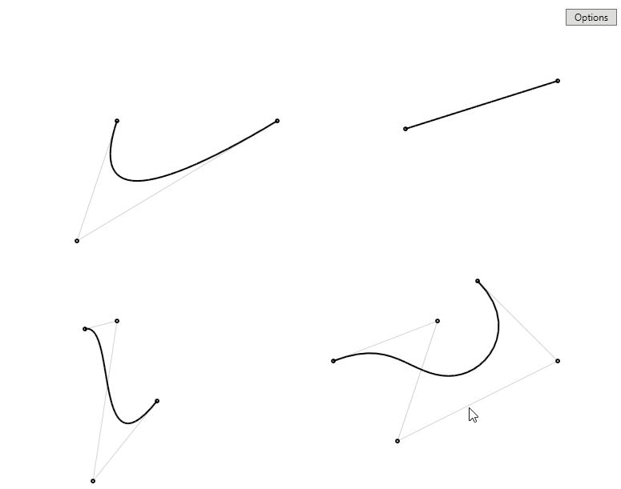
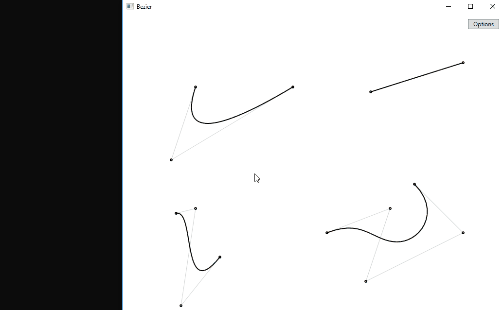

# Bezier

A C# application exploring Bezier curves. Currently implements quadratic, cubic and
quartic Bezier curves, and allows them to be manipulated by their weights.

Curve intersections are implemented for all except the quartic curve.

### Demos

